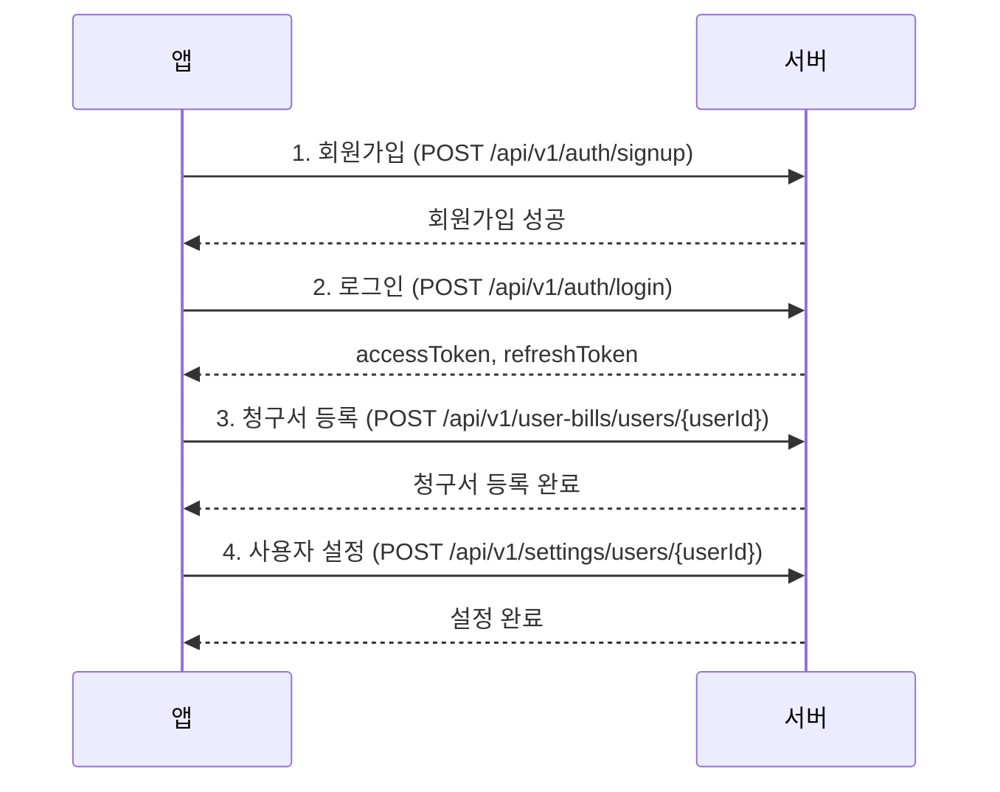

# AI 분석 시스템 플로우

## 개요

모아드림의 AI 분석 시스템은 사용자의 에너지 사용 데이터를 분석하여 패턴을 파악하고, 맞춤형 절약 추천을 제공하며, 절감 효과를 추적하는 3단계 시스템입니다.

## 전체 플로우

```
1. 사용량 데이터 수집
   ↓
2. 패턴 분석 (UsagePattern)
   ↓
3. AI 추천 생성 (Recommendation)
   ↓
4. 추천 적용
   ↓
5. 절감 효과 추적 (SavingsTracking)
```

---

## 1단계: 사용량 데이터 수집

### API
```http
POST /api/v1/usage-data/users/{userId}
```

### 데이터
- 유틸리티 타입 (전기/수도/가스)
- 사용량
- 요금
- 측정 시간

### 자동 처리
사용량 데이터가 추가될 때마다 **예산 임계값 자동 체크**가 실행됩니다.

```java
// UsageDataService.java:53
checkThresholdAndCreateAlert(user, request.getUtilityType(), request.getMeasuredAt());
```

- 월 예산 대비 사용량 계산
- 임계값 초과 시 자동 알림 생성
- AlertType: BUDGET_EXCEEDED

---

## 2단계: 패턴 분석

### API
```http
POST /api/v1/patterns/users/{userId}/analyze
```

### 분석 주기
- **DAILY**: 최근 7일
- **WEEKLY**: 최근 4주
- **MONTHLY**: 최근 3개월
- **SEASONAL**: 최근 1년

### 분석 지표
1. **평균 사용량** (averageUsage)
   - 기간 내 전체 사용량의 평균

2. **피크 사용량** (peakUsage)
   - 상위 20% 사용량의 평균

3. **오프피크 사용량** (offPeakUsage)
   - 하위 20% 사용량의 평균

4. **추세** (trend)
   - 전반부와 후반부 평균 비교
   - 10% 이상 증가 → "증가"
   - 10% 이상 감소 → "감소"
   - 그 외 → "안정"

### 조회 API
```http
GET /api/v1/patterns/users/{userId}
GET /api/v1/patterns/users/{userId}/type/{utilityType}
```

---

## 3단계: AI 추천 생성

### API
```http
POST /api/v1/recommendations/users/{userId}/generate
```

### 추천 생성 로직

#### 1) 증가 추세 감지
```java
if ("증가".equals(pattern.getTrend())) {
    // 사용량 절감 추천
    // 행동 변화 추천
}
```

**생성되는 추천:**
- **USAGE_REDUCTION**: 사용량 절감 방안 (예상 절감: 15%)
- **BEHAVIOR_CHANGE**: 행동 변화 제안 (예상 절감: 10%)

#### 2) 피크 사용량 감지
```java
if (peakUsage > averageUsage * 2) {
    // 시간대 이동 추천
}
```

**생성되는 추천:**
- **TIME_SHIFT**: 경부하 시간대 사용 (예상 절감: 20%)

#### 3) 전기 사용량 과다
```java
if (utilityType == ELECTRICITY && averageUsage > 300) {
    // 가전 업그레이드 추천
}
```

**생성되는 추천:**
- **APPLIANCE_UPGRADE**: 에너지 효율 가전 교체 (예상 절감: 25%)

#### 4) 기본 추천
모든 유틸리티에 대해 항상 생성:
- **TARIFF_OPTIMIZATION**: 요금제 최적화 (예상 절감: 8%)

### 추천 예시

#### 전기 - 증가 추세
```json
{
  "utilityType": "ELECTRICITY",
  "recType": "USAGE_REDUCTION",
  "recommendationText": "최근 전기 사용량이 증가하고 있습니다. 대기전력 차단과 불필요한 조명 끄기를 실천해보세요.",
  "expectedSavings": 15000,
  "implementationDifficulty": "보통"
}
```

#### 수도 - 행동 변화
```json
{
  "utilityType": "WATER",
  "recType": "BEHAVIOR_CHANGE",
  "recommendationText": "양치질이나 설거지 시 물을 받아서 사용하면 수도 사용량을 크게 줄일 수 있습니다.",
  "expectedSavings": 8000,
  "implementationDifficulty": "쉬움"
}
```

### 조회 API
```http
GET /api/v1/recommendations/users/{userId}
GET /api/v1/recommendations/users/{userId}/unapplied
```

---

## 4단계: 추천 적용

### API
```http
PATCH /api/v1/recommendations/{recId}/apply
```

### 처리
```java
recommendation.markAsApplied();
// isApplied: false → true
```

사용자가 추천을 확인하고 적용했음을 표시합니다.

---

## 5단계: 절감 효과 추적

### 추적 시작
```http
POST /api/v1/savings/users/{userId}/recommendations/{recId}/start
```

**처리:**
1. 지난 달 사용 비용을 **기준 비용(baselineCost)**으로 설정
2. 현재 월의 추적 데이터 생성
3. 초기값:
   - actualUsage: 0
   - actualCost: 0
   - savingsAchieved: 0

### 추적 업데이트
```http
PATCH /api/v1/savings/{trackingId}/update
```

**처리:**
1. 현재 월의 실제 사용량 조회
2. 실제 비용 계산
3. **절감액 계산**: `baselineCost - actualCost`
4. 데이터 업데이트

### 예시

#### 추적 시작 (10월)
```json
{
  "trackingMonth": "2025-10-01",
  "baselineCost": 50000,  // 9월 비용
  "actualCost": 0,
  "savingsAchieved": 0
}
```

#### 추적 업데이트 (10월 말)
```json
{
  "trackingMonth": "2025-10-01",
  "baselineCost": 50000,
  "actualCost": 42000,
  "savingsAchieved": 8000  // 8천원 절감!
}
```

### 통계 조회
```http
GET /api/v1/savings/users/{userId}
GET /api/v1/savings/users/{userId}/period?startMonth=2025-01-01&endMonth=2025-12-31
GET /api/v1/savings/users/{userId}/total
```

---

## 자동화 시스템

### 1. 월별 청구서 자동 생성
```java
@Scheduled(cron = "0 0 0 1 * *")  // 매월 1일 00:00
public void generateMonthlyBills()
```

**처리:**
- 전월 사용량 데이터 집계
- 유틸리티 타입별 청구서 생성
- 납부 기한: 익월 15일

### 2. 예산 임계값 자동 알림
```java
// UsageData 추가 시 자동 실행
checkThresholdAndCreateAlert()
```

**처리:**
- 월 누적 사용 요금 계산
- 사용자 설정 임계값과 비교
- 초과 시 알림 자동 생성

---

## 데이터베이스 관계

```
User (사용자)
 ├─ UsageData (사용량 데이터) [1:N]
 ├─ UsagePattern (패턴 분석) [1:N]
 ├─ Recommendation (추천) [1:N]
 ├─ SavingsTracking (절감 추적) [1:N]
 └─ MonthlyBill (월별 청구서) [1:N]

Recommendation (추천)
 └─ SavingsTracking (절감 추적) [1:N]
```

---

## 전체 사용 시나리오

### 시나리오: 신규 사용자의 첫 달

#### Week 1: 데이터 수집
```http
POST /api/v1/usage-data/users/1
{
  "utilityType": "ELECTRICITY",
  "usageAmount": 150,
  "currentCharge": 15000,
  "measuredAt": "2025-10-01T10:00:00"
}
```

- 일주일 동안 매일 데이터 수집
- 예산 임계값 자동 체크

#### Week 2: 패턴 분석
```http
POST /api/v1/patterns/users/1/analyze
```

**결과:**
- DAILY 패턴: 평균 150kWh, 피크 200kWh
- 추세: "안정"

#### Week 3: AI 추천 생성
```http
POST /api/v1/recommendations/users/1/generate
```

**생성된 추천:**
1. 요금제 최적화 (예상 절감: 8%)
2. 시간대 이동 (예상 절감: 20%)

#### Week 4: 추천 적용 및 추적 시작
```http
# 추천 적용
PATCH /api/v1/recommendations/5/apply

# 절감 추적 시작
POST /api/v1/savings/users/1/recommendations/5/start
```

#### Next Month: 효과 확인
```http
# 절감 추적 업데이트
PATCH /api/v1/savings/1/update

# 결과 확인
GET /api/v1/savings/users/1/total
```

**결과:**
- 기준 비용: 45,000원
- 실제 비용: 38,000원
- 절감액: 7,000원 (15.6% 절감)

---

## 향후 확장 계획

### Phase 3.5: 실제 AI 모델 적용
현재는 룰 기반 추천 엔진이지만, 향후 PyTorch 기반 머신러닝 모델로 전환 예정:

1. **데이터 수집 및 전처리**
   - 사용 패턴 데이터 축적
   - Python/Pandas로 전처리

2. **모델 학습**
   - PyTorch 기반 시계열 예측 모델
   - 사용자별 맞춤형 추천 모델

3. **추천 엔진 통합**
   - Spring Boot ↔ Python 연동
   - REST API 또는 gRPC 통신

4. **지속적 학습**
   - 사용자 피드백 수집
   - 모델 재학습 및 개선

---

## API 요약

| 기능 | Method | Endpoint |
|------|--------|----------|
| 패턴 분석 실행 | POST | `/api/v1/patterns/users/{userId}/analyze` |
| 패턴 조회 | GET | `/api/v1/patterns/users/{userId}` |
| 추천 생성 | POST | `/api/v1/recommendations/users/{userId}/generate` |
| 미적용 추천 조회 | GET | `/api/v1/recommendations/users/{userId}/unapplied` |
| 추천 적용 | PATCH | `/api/v1/recommendations/{recId}/apply` |
| 절감 추적 시작 | POST | `/api/v1/savings/users/{userId}/recommendations/{recId}/start` |
| 절감 추적 업데이트 | PATCH | `/api/v1/savings/{trackingId}/update` |
| 총 절감액 조회 | GET | `/api/v1/savings/users/{userId}/total` |

---

## 앱 개발자를 위한 API 연계 가이드

### 1. 초기 설정 플로우 (신규 사용자)



#### Step 1: 회원가입
```http
POST /api/v1/auth/signup
Content-Type: application/json

{
  "email": "user@example.com",
  "password": "password123",
  "name": "홍길동",
  "phoneNumber": "010-1234-5678",
  "address": "서울시 강남구"
}
```

#### Step 2: 로그인
```http
POST /api/v1/auth/login
Content-Type: application/json

{
  "email": "user@example.com",
  "password": "password123"
}
```

**응답:**
```json
{
  "accessToken": "eyJhbGciOiJIUzI1NiIsInR5cCI6IkpXVCJ9...",
  "refreshToken": "eyJhbGciOiJIUzI1NiIsInR5cCI6IkpXVCJ9..."
}
```

**중요:**
- accessToken을 로컬 스토리지/SharedPreferences에 저장
- 모든 이후 요청의 Authorization 헤더에 포함
- `Authorization: Bearer {accessToken}`

#### Step 3: 청구서 등록 (전기, 수도, 가스)
```http
POST /api/v1/user-bills/users/1
Authorization: Bearer {accessToken}
Content-Type: application/json

{
  "utilityType": "ELECTRICITY",
  "billNumber": "1234567890",
  "customerNumber": "0987654321"
}
```

각 유틸리티(ELECTRICITY, WATER, GAS)에 대해 3번 호출

#### Step 4: 초기 설정
```http
POST /api/v1/settings/users/1
Authorization: Bearer {accessToken}
Content-Type: application/json

{
  "monthlyBudget": 200000,
  "alertThreshold": 80,
  "notificationEnabled": true
}
```

---

### 2. 메인 화면 로드 플로우

앱 실행 시 메인 화면에서 필요한 데이터를 병렬로 조회합니다.

```javascript
// 병렬 API 호출 예시 (React Native/Flutter)
const loadMainScreen = async (userId) => {
  const [
    userInfo,
    userSettings,
    latestElectric,
    latestWater,
    latestGas,
    unpaidBills,
    unreadAlerts
  ] = await Promise.all([
    // 1. 사용자 정보
    fetch(`/api/v1/auth/users/${userId}`),

    // 2. 사용자 설정
    fetch(`/api/v1/settings/users/${userId}`),

    // 3. 최신 사용량 (전기)
    fetch(`/api/v1/usage-data/users/${userId}/latest?utilityType=ELECTRICITY`),

    // 4. 최신 사용량 (수도)
    fetch(`/api/v1/usage-data/users/${userId}/latest?utilityType=WATER`),

    // 5. 최신 사용량 (가스)
    fetch(`/api/v1/usage-data/users/${userId}/latest?utilityType=GAS`),

    // 6. 미납 청구서
    fetch(`/api/v1/bills/users/${userId}/unpaid`),

    // 7. 안 읽은 알림
    fetch(`/api/v1/alerts/users/${userId}/unread`)
  ]);

  return {
    userInfo,
    userSettings,
    currentUsage: { latestElectric, latestWater, latestGas },
    unpaidBills,
    unreadAlerts
  };
};
```

**화면 구성:**
```
┌─────────────────────────────┐
│ 안녕하세요, 홍길동님         │
│ 오늘의 에너지 사용량         │
├─────────────────────────────┤
│ 🔌 전기: 150kWh (15,000원)  │
│ 💧 수도: 10m³ (8,000원)     │
│ 🔥 가스: 50m³ (25,000원)    │
├─────────────────────────────┤
│ 📊 월 예산 대비: 68% 사용    │
│ 🔔 새 알림 3개               │
│ 💳 미납 청구서 1건           │
└─────────────────────────────┘
```

---

### 3. 기능별 화면 플로우

#### 3.1. 사용량 기록 화면

**화면 진입:**
```http
GET /api/v1/usage-data/users/1/type/ELECTRICITY
Authorization: Bearer {accessToken}
```

**새 사용량 추가:**
```http
POST /api/v1/usage-data/users/1
Authorization: Bearer {accessToken}
Content-Type: application/json

{
  "utilityType": "ELECTRICITY",
  "usageAmount": 150,
  "unit": "kWh",
  "currentCharge": 15000,
  "measuredAt": "2025-10-28T10:00:00"
}
```

**중요:** 사용량 추가 시 자동으로 예산 초과 알림이 생성될 수 있습니다!

---

#### 3.2. 패턴 분석 화면

**Step 1: 패턴 분석 실행**
```http
POST /api/v1/patterns/users/1/analyze
Authorization: Bearer {accessToken}
```

분석에는 몇 초가 소요될 수 있으므로 로딩 표시 필요

**Step 2: 결과 조회**
```http
GET /api/v1/patterns/users/1/type/ELECTRICITY
Authorization: Bearer {accessToken}
```

**화면 구성:**
```
┌─────────────────────────────┐
│ 전기 사용 패턴 분석          │
├─────────────────────────────┤
│ 📈 월간 추세: 증가           │
│ 📊 평균 사용량: 150kWh       │
│ ⚡ 피크 사용량: 220kWh       │
│ 🌙 오프피크: 80kWh           │
├─────────────────────────────┤
│ [일별] [주별] [월별] [계절별]│
└─────────────────────────────┘
```

---

#### 3.3. AI 추천 화면

**Step 1: AI 추천 생성**
```http
POST /api/v1/recommendations/users/1/generate
Authorization: Bearer {accessToken}
```

**Step 2: 미적용 추천 조회**
```http
GET /api/v1/recommendations/users/1/unapplied
Authorization: Bearer {accessToken}
```

**Step 3: 추천 적용**
```http
PATCH /api/v1/recommendations/5/apply
Authorization: Bearer {accessToken}
```

**화면 구성:**
```
┌─────────────────────────────┐
│ 💡 AI 절약 추천              │
├─────────────────────────────┤
│ 1. 🔌 전기 사용량 절감       │
│    예상 절감: 15,000원       │
│    난이도: 보통              │
│    [자세히 보기] [적용하기]  │
├─────────────────────────────┤
│ 2. ⏰ 시간대 이동            │
│    예상 절감: 20,000원       │
│    난이도: 쉬움              │
│    [자세히 보기] [적용하기]  │
└─────────────────────────────┘
```

**추천 상세 화면:**
```
┌─────────────────────────────┐
│ 🔌 전기 사용량 절감          │
├─────────────────────────────┤
│ 최근 전기 사용량이 증가하고  │
│ 있습니다. 대기전력 차단과    │
│ 불필요한 조명 끄기를 실천    │
│ 해보세요.                    │
├─────────────────────────────┤
│ 예상 절감액: 월 15,000원     │
│ 구현 난이도: 보통            │
├─────────────────────────────┤
│ [적용하기] [나중에]          │
└─────────────────────────────┘
```

---

#### 3.4. 절감 효과 화면

**Step 1: 절감 추적 시작**
```http
POST /api/v1/savings/users/1/recommendations/5/start
Authorization: Bearer {accessToken}
```

**Step 2: 절감 효과 조회**
```http
GET /api/v1/savings/users/1
Authorization: Bearer {accessToken}
```

**Step 3: 총 절감액 조회**
```http
GET /api/v1/savings/users/1/total
Authorization: Bearer {accessToken}
```

**화면 구성:**
```
┌─────────────────────────────┐
│ 💰 절감 효과                 │
├─────────────────────────────┤
│ 총 절감액: 45,000원          │
│ 이번 달: 8,000원 절감        │
├─────────────────────────────┤
│ 10월 (전기)                  │
│ 기준: 50,000원               │
│ 실제: 42,000원               │
│ 절감: 8,000원 (16% ↓)       │
├─────────────────────────────┤
│ 9월 (수도)                   │
│ 기준: 25,000원               │
│ 실제: 22,000원               │
│ 절감: 3,000원 (12% ↓)       │
└─────────────────────────────┘
```

---

#### 3.5. 청구서 화면

**Step 1: 청구서 목록 조회**
```http
GET /api/v1/bills/users/1
Authorization: Bearer {accessToken}
```

**Step 2: 미납 청구서 조회**
```http
GET /api/v1/bills/users/1/unpaid
Authorization: Bearer {accessToken}
```

**Step 3: 납부 처리**
```http
PATCH /api/v1/bills/123/pay
Authorization: Bearer {accessToken}
```

---

#### 3.6. 알림 화면

**Step 1: 안 읽은 알림 조회**
```http
GET /api/v1/alerts/users/1/unread
Authorization: Bearer {accessToken}
```

**Step 2: 알림 읽음 처리**
```http
PATCH /api/v1/alerts/456/read
Authorization: Bearer {accessToken}
```

**Step 3: 모든 알림 읽음 처리**
```http
PATCH /api/v1/alerts/users/1/read-all
Authorization: Bearer {accessToken}
```

---

### 4. 주기적 업데이트 전략

#### 4.1. 포그라운드 (앱 사용 중)
```javascript
// 메인 화면에서 30초마다 업데이트
setInterval(async () => {
  const unreadAlerts = await fetch(`/api/v1/alerts/users/${userId}/unread`);
  updateBadge(unreadAlerts.length);
}, 30000);
```

#### 4.2. 백그라운드 (앱이 백그라운드)
```javascript
// 푸시 알림 수신 시
onPushNotification((notification) => {
  if (notification.type === 'BUDGET_EXCEEDED') {
    // 예산 초과 알림
    showNotification('월 예산의 80%를 초과했습니다!');
  }
});
```

#### 4.3. 매일 업데이트 (Daily Sync)
```javascript
// 매일 자정 또는 앱 첫 실행 시
const dailySync = async () => {
  // 1. 패턴 분석 업데이트 (일주일에 1회)
  if (shouldAnalyzePattern()) {
    await fetch(`/api/v1/patterns/users/${userId}/analyze`, { method: 'POST' });
  }

  // 2. 절감 추적 업데이트
  const trackings = await fetch(`/api/v1/savings/users/${userId}`);
  for (const tracking of trackings) {
    await fetch(`/api/v1/savings/${tracking.trackingId}/update`, { method: 'PATCH' });
  }
};
```

---

### 5. 토큰 갱신 처리

```javascript
// API 호출 인터셉터
const apiCall = async (url, options) => {
  try {
    const response = await fetch(url, {
      ...options,
      headers: {
        ...options.headers,
        'Authorization': `Bearer ${getAccessToken()}`
      }
    });

    if (response.status === 401) {
      // 토큰 만료, 갱신 시도
      const refreshed = await refreshToken();
      if (refreshed) {
        // 갱신 성공, 원래 요청 재시도
        return apiCall(url, options);
      } else {
        // 갱신 실패, 로그인 화면으로
        navigateToLogin();
      }
    }

    return response;
  } catch (error) {
    console.error('API Error:', error);
    throw error;
  }
};

const refreshToken = async () => {
  try {
    const response = await fetch('/api/v1/auth/refresh', {
      method: 'POST',
      headers: { 'Content-Type': 'application/json' },
      body: JSON.stringify({
        refreshToken: getRefreshToken()
      })
    });

    if (response.ok) {
      const { accessToken, refreshToken } = await response.json();
      saveAccessToken(accessToken);
      saveRefreshToken(refreshToken);
      return true;
    }
    return false;
  } catch (error) {
    return false;
  }
};
```

---

### 6. 에러 처리

```javascript
const handleApiError = (error, response) => {
  switch (response.status) {
    case 400:
      // 잘못된 요청
      showError('입력 정보를 확인해주세요.');
      break;
    case 401:
      // 인증 실패
      navigateToLogin();
      break;
    case 403:
      // 권한 없음
      showError('접근 권한이 없습니다.');
      break;
    case 404:
      // 리소스 없음
      showError('요청한 정보를 찾을 수 없습니다.');
      break;
    case 500:
      // 서버 오류
      showError('서버 오류가 발생했습니다. 잠시 후 다시 시도해주세요.');
      break;
    default:
      showError('알 수 없는 오류가 발생했습니다.');
  }
};
```

---

### 7. 최적화 팁

#### 7.1. 캐싱 전략
```javascript
// 자주 변하지 않는 데이터는 캐싱
const cache = {
  userSettings: null,
  userInfo: null,
  lastFetch: null
};

const getUserSettings = async (userId, forceRefresh = false) => {
  const now = Date.now();
  const cacheExpiry = 5 * 60 * 1000; // 5분

  if (!forceRefresh &&
      cache.userSettings &&
      (now - cache.lastFetch) < cacheExpiry) {
    return cache.userSettings;
  }

  const settings = await fetch(`/api/v1/settings/users/${userId}`);
  cache.userSettings = settings;
  cache.lastFetch = now;
  return settings;
};
```

#### 7.2. 배치 요청
```javascript
// 여러 유틸리티의 최신 데이터를 한 번에 조회
const getLatestUsageAll = async (userId) => {
  const types = ['ELECTRICITY', 'WATER', 'GAS'];
  const promises = types.map(type =>
    fetch(`/api/v1/usage-data/users/${userId}/latest?utilityType=${type}`)
  );
  return Promise.all(promises);
};
```

#### 7.3. 페이지네이션
```javascript
// 사용량 이력 조회 시 페이지네이션 사용 (미구현, 추후 추가 예정)
const getUsageHistory = async (userId, page = 0, size = 20) => {
  return fetch(`/api/v1/usage-data/users/${userId}?page=${page}&size=${size}`);
};
```

---

### 8. 완전한 플로우 예시 (Pseudo Code)

```javascript
// 앱 실행
async function onAppLaunch() {
  // 1. 로그인 상태 체크
  const isLoggedIn = checkLoginStatus();

  if (!isLoggedIn) {
    // 로그인 화면으로
    navigateTo('Login');
    return;
  }

  // 2. 토큰 유효성 체크
  const tokenValid = await validateToken();
  if (!tokenValid) {
    const refreshed = await refreshToken();
    if (!refreshed) {
      navigateTo('Login');
      return;
    }
  }

  // 3. 메인 화면 데이터 로드
  showLoading(true);
  const mainData = await loadMainScreen(userId);
  showLoading(false);

  // 4. 메인 화면 렌더링
  renderMainScreen(mainData);

  // 5. 백그라운드 업데이트 시작
  startBackgroundSync();
}

// 패턴 분석 버튼 클릭
async function onAnalyzePatternClick() {
  showLoading(true, '사용 패턴을 분석하고 있습니다...');

  try {
    // 1. 패턴 분석 실행
    await fetch(`/api/v1/patterns/users/${userId}/analyze`, {
      method: 'POST'
    });

    // 2. 분석 결과 조회
    const patterns = await fetch(`/api/v1/patterns/users/${userId}`);

    // 3. 결과 화면으로 이동
    navigateTo('PatternResult', { patterns });
  } catch (error) {
    showError('패턴 분석 중 오류가 발생했습니다.');
  } finally {
    showLoading(false);
  }
}

// AI 추천 생성 버튼 클릭
async function onGenerateRecommendationsClick() {
  showLoading(true, 'AI가 맞춤형 추천을 생성하고 있습니다...');

  try {
    // 1. 추천 생성
    const recommendations = await fetch(
      `/api/v1/recommendations/users/${userId}/generate`,
      { method: 'POST' }
    );

    // 2. 추천 화면으로 이동
    navigateTo('Recommendations', { recommendations });
  } catch (error) {
    showError('추천 생성 중 오류가 발생했습니다.');
  } finally {
    showLoading(false);
  }
}

// 추천 적용 버튼 클릭
async function onApplyRecommendationClick(recId) {
  const confirmed = await showConfirm('이 추천을 적용하시겠습니까?');
  if (!confirmed) return;

  try {
    // 1. 추천 적용
    await fetch(`/api/v1/recommendations/${recId}/apply`, {
      method: 'PATCH'
    });

    // 2. 절감 추적 시작
    await fetch(`/api/v1/savings/users/${userId}/recommendations/${recId}/start`, {
      method: 'POST'
    });

    showSuccess('추천이 적용되었습니다! 절감 효과를 추적하기 시작합니다.');

    // 3. 절감 효과 화면으로 이동
    navigateTo('SavingsTracking');
  } catch (error) {
    showError('추천 적용 중 오류가 발생했습니다.');
  }
}
```

---

## 참고 문서

- [README.md](../README.md) - 프로젝트 전체 개요
- [PROJECT_TARGET.pdf](../PROJECT_TARGET.pdf) - 작품 소개서
- [Database Schema](../README.md#데이터베이스-구조) - DB 구조